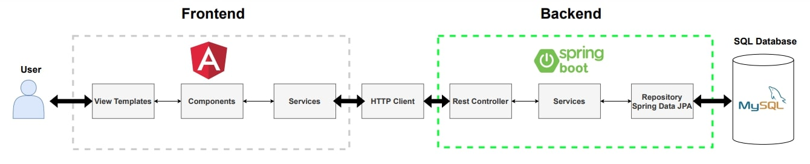
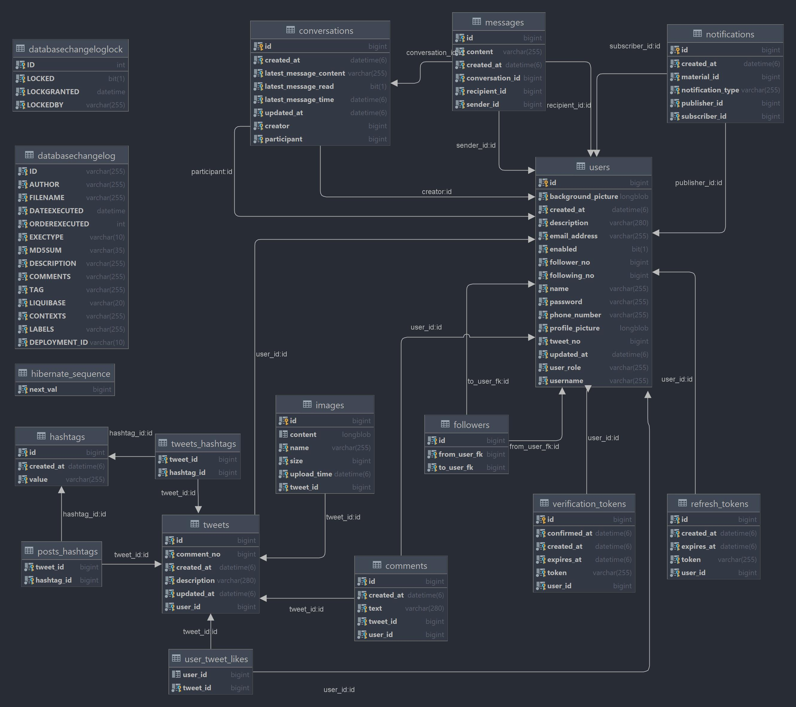

# Twitter Clone Demo Web Application

## Table of Contents
* [General info](#general-info)
* [Technologies](#technologies)
* [Dependencies](#dependencies)
* [Entity Reliationship Diagram](#entity-relationship-diagram)
* [Features](#features)
* [Status](#status)
* [Example Screenshots](#example-screenshots)

## General info

### Frontend Repository: [Frontend](https://github.com/poik12/twitter-clone-frontend)
### Backend Repository:  [Backend](https://github.com/poik12/twitter-clone-backend)

## Technologies
### Java Version: 17 LTS
### Spring Boot Version: 2.5.7
### Node version: 14.17.4
### Angular CLI version: 12.2.1

## Dependencies
### Backend
- Spring Web
- Spring Data JPA
- MySql Driver
- H2 Database
- Liquibase Migration
- Spring Security
- Spring Validation
- JWT
- Java Mail Sender
- Lombok
- Springfox Swagger 3.0.0
- TimeAgo - library for displaying dates as relative time ago language
- JUnit 5
- AssertJ
- Mockito

### Frontend
- Angular Material
- Angular Hashtag and Mentions Colorizer - https://github.com/alessiaAmitrano/hashtag-mention-colorizer
- Angular Infinite Scroll - https://www.npmjs.com/package/ngx-infinite-scroll
- NgxSpinner - https://www.npmjs.com/package/ngx-spinner

## Entity Relationship Diagram

## Features
1. Sign in / Sign up page:
  - sign up with email confirmation
  - login authentication
  - authorization with access token
2. Home page:
  - display paginated tweets - loading subsequent pages via infinite scroll
  - add new tweet with multiple images and #hashtags
  - remove user's tweets
  - like tweets
  - show details of the tweet with paginated comments
  - add comments to the selected tweet
  - displaying notifications about various user activities on the screen
3. User profile page:
  - display details about user
  - follow user
  - check followers and followings
  - update user profile
  - add user to conversation
  - check selected user profile
  - check user's followers and following
  - display user's tweets paginated
  - display paginated tweets that user commented - 3 last user's comments
  - display paginated tweets that user liked
4. Messages page:
  - display paginated user's conversations
  - send messages to other users in selected conversations
5. Notifications page:
  - notifications about new user followers
  - notifications from followed users when they add new tweet
  - notifications about new comments to user's tweets
  - notifications about user's tweet likes

## Status
Project is: _in progress_ / _suspended_

What's next:
- searching for tweets through hashtags
- searching new users
- send invitation to conversation and notify the invited user
- notifications about new messages form other users

## Example Screenshots
